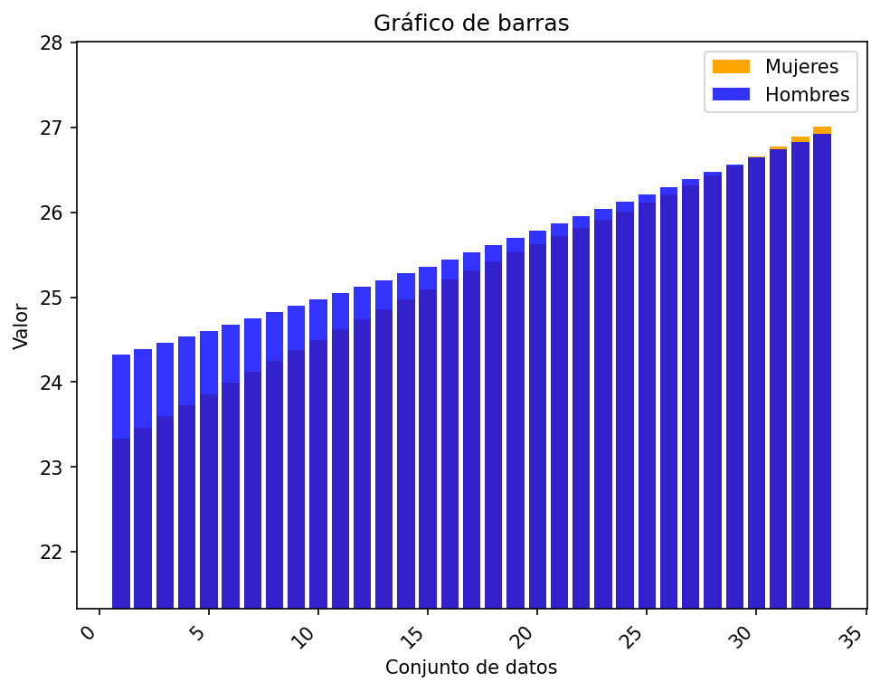

# Informe IMC Latinoamética
## Estadística I, grupo 4

Realizado por: Jhonny Zapata Salas

Ingeniería Civil - Facultad de Ingeniería UdeA

### Introducción

El presente escrito corresponde al informe de resultados de la actividad 1 del curso de estadística para ingenieros, para la realización del mismo se utilizó los datos suministrados por medio de un archivo de hojas de cálculo, con datos del IMC promedio discriminado por ubicación (urbano/rural) y género (hombres/mujeres) en los países de suramérica entre el año 1985 y 2017. Para el tratamiento de los datos se utilizan los conceptos básicos de la estadística como lo son las medidas de tendencia central, la desviación estándar como medida de dispersión, medidas de posición relativa y las representaciones gráficas posibles con dichos datos. Los cálculos fueron realizados por medio de scripts programados en Python, y las representaciones gráficas con la librería matplotlib de python. Se espera que el presente texto sea entendible y logre los objetivos de la actividad evaluativa.

### Información preliminar

Los datos utilizados para los cálculos fueron facilitados por el docente por medio de un archivo de hoja de cálculo en formato '.ods', y que el autor decidió pasar a formato '.cvs' motivado por su universalidad, eficiencia y simplicidad, además de evitar el uso de librerías de manipulación de archivos especializados. Las columnas del conjuto de datos brindan la siguiente información:

+ Country (País)
+ Sex (Sexo)
+ Year (año)
+ MeanUrbanBMI (IMC urbano promedio)
+ MeanRuralBMI (IMC rural promedio)
+ MeanDifference (Diferencia de medias)

El tamaño del conjuto de datos es de 792 datos correspondientes a los 12 países de América del sur, de cada país hay 66 datos (33 de hombres y 33 de mujeres) y cada dato proporciona el IMC promedio urbano y rural de los años entre 1985 y 2017. La siguiente tabla muestra la representación del conjunto de datos.

|Country|Sex|Year|MeanUrbanBMI| MeanRuralBMI | MedaDifference |
|:--|:--:|:--:|:-:| :-: | :-: |
|Argentina | Men | 1985 | 25.36350947 | 24.32177193 | 1.04173754|
|Argentina| Men| 1986| 25.4310682 | 24.39209307 | 1.03897513 |
|... |... | ...| ... | ... | ... |
|Venezuela|Women|2016|26.96489251|26.06339663|0.901495879999999 |
Venezuela|Women|2017|27.01125702|26.13488195|0.876375069999998 |

Para procesar los datos brindados se hizo escribió un código escrito en el lenguaje de programación Python y la librería estándar. Para la representación gráfica se hizo uso de la librería matplotlib, los archivos que contienen el código están contenidos en este repositorio en el directorio 'src'.

### Reporte de resultados

Después de obtener los valores de medidas de tendencia central del conjunto de datos se generaron gráficas, de las cuales algunas serán presentadas a continuación.

#### Media de IMC por país 

En Argentina, los datos de la población urbana nos da el siguiente gráfico:

En este gráfico se puede observar que historicamente los hombres han tenido un IMC promedio mayor que las mujeres en la población urbana, además que el valor incrementó con el paso de los años. Ahora, si consideramos que según el portal Unidiversidad la estatura promedio de los hombres argentinos en 1985 era de 174.45 cm, y de 154.44 cm. Y según el portal datosmundial la altura promedio actual es de 174 cm para hombres y 161 cm para mujeres. Es decir, mientras que los hombres poco varió la altura, el peso aumento aproximado de 4 kg. Y para las mujeres el incremento fue de aproximadamente 6 kg. 

En el entorno rural se puede observar que el comportamiento fue similar, es decir creciente, sin embargo la principal diferencia se da en el hecho que en lo urbano la diferencia entre IMC de hombres y mujeres se mantuvo, en la ruralidad se estrechó el margen, al punto que para el año 2015 el IMC promedio fue aproximadamente igual.

Ahora, considerando que la población argentina es en su mayoría urbana, se realizó un ajuste para evaluar la diferencia entre IMC entre hombres y mujeres sin diferenciar por localización, para lograr esto fue necesario ampliar la información con datos obtenidos en los portales datosmacro e indexmundi, el resultado obtenido fue el siguiente:

Aquí se puede observar que la diferencia entre hombres y mujeres es muy similar para cada año, esta situación se explica con facilidad al tener presente que la ruralidad en Argentina para 1985 era del 14.96% y para 2017 de 8.25%, es decir la diferencia observada en la ruralidad tiene poco impacto en el resultado global. 

Por otro lado si calculamos el valor medio de los datos por sexo obtenemos la siguiente gráfica.

En esta se observa lo que ya se ha dejado claro, el IMC de los hombres es superior al de las mujeres, aunque vale la pena aclarar que según las estimaciones hechas el peso promedio de los hombres para 1985 era de 44.1 kg y para 2017 de 48.5 kg, mientras para las mujeres fue de 37.8 kg y 44kg respectivamente.

Para cerrar con Argentina se reportan los valores obtenidos en la siguiente tabla:

| Conjunto de datos | media | desviación estándar | Q1 | Q2 | Q3 |
| :-- | :--: | :--: | :--: | :--: | :--: |
| Hombres Urbano | 26.559  | 0.763  | 25.914 | 26.523  | 27.185 |
| Hombres Rural | 25.561  | 0.789  | 24.895 | 25.525  | 26.210 |
| Mujeres Urbano | 25.989  | 0.829  | 25.334 | 26.065  | 26.645 |
| Mujeres Rural | 25.242  | 1.085  | 24.374 | 25.318  | 26.110 |

Ahora, si pasamos a los datos de Bolivia se puede observar que el comportamiento si bien también es creciente, el IMC de las mujeres es superior al de los hombres. A continuación el gráfico de la población urbana, rural y global obtenidos.

| Conjunto de datos | media | desviación estándar | Q1 | Q2 | Q3 |
| :-- | :--: | :--: | :--: | :--: | :--: |
| Hombres Urbano | 24.949  | 0.873  | 24.207 | 24.881  | 25.657 |
| Hombres Rural | 24.004  | 0.734  | 23.377 | 23.936  | 24.597 |
| Mujeres Urbano | 26.436  | 1.096  | 25.533 | 26.475  | 27.310 |
| Mujeres Rural | 25.011  | 1.210  | 24.013 | 25.050  | 25.980 |

Urbano:

Rural:

Global:

Es bastante inquietante que a nivel global la tasa de crecimiento del IMC en mujeres es mucho mayor que el de hombres.

Si observamos la situación para Colombia obtenemos los siguientes resultados:

| Conjunto de datos | media | desviación estándar | Q1 | Q2 | Q3 |
| :-- | :--: | :--: | :--: | :--: | :--: |
| Hombres Urbano | 24.583  | 0.850  | 23.870 | 24.577  | 25.291 |
| Hombres Rural | 23.376  | 0.833  | 22.677 | 23.370  | 24.071 |
| Mujeres Urbano | 25.599  | 0.788  | 25.020 | 25.759  | 26.212 |
| Mujeres Rural | 25.119  | 0.972  | 24.387 | 25.279  | 25.886 |

Urbano:

Rural:

Global:

Se puede concluir entonces que el comportamiento en Colombia si bien es similar al de Bolivia, el margen entre hombres y mujeres es aproximadamente constante. 

Respecto a los datos anteriores que queda por decir que a falta de datos sobre las estaturas promedio de los años tratados es imposible realizar conclusiones contundentes.

### Conclusiones

Las medidas de tendencia central nos permiten presentar información de una manera mas o menos ordenada y de los que se puede extraer información, sin embargo estas herramientas no permiten produnfizar en la información dado su caracter general, y para este caso se suma el hecho que se estan considerando datos que se relacionan con los cambios temporales, culturas y economicos. Por lo que no se pueden realizar afirmaciones con contundencia.

Respecto a los resultados entregados se pudo observar que en todos los países de Sur América el IMC ha venido en incremento, situación que está relacionada con la alimentación y los cambios geneticos con la variación de estaturas, que en algunos casos se afirma ha cambiado 10cm en los últimos 100 años. 

Por ultimo, si bien se obtuvo los gráficos de cajas de bigotes, el autor no tiene claro como tratarlos ya que se trata de diferentes generaciones, sin embargo para dar uso a dichos resultados reporta en la siguiente sección "extra" algunos de dichos gráficos.

### Extra

Los siguientes gráficos corresponden a Suriname, uno de los países más pequeños de América del sur.

#### Urbanos:

Hombres:

Mujeres:

#### Rural

Hombres:

Mujeres:

En ellos podemos observar que los datos tienen una distribución mas o menos uniforme, es decir no hay presencia de muchos datos atipicos, a excepción pues de los hombres rurales.

Quizá la explicación a esta situación está en el hecho que mientras el IMC promedio de las mujeres incrementó de manera casi constante para cada año, el de los hombres inicialmente tuvo un incremento muy bajo al inicio, pero para los años 2000 el incremento fue mucho mayor. Dando así un "mayor" rango de valores posibles, y por tanto de los primeros valores se salen de lo esperado.

## Notas finales

El autor acepta que se pudo realizar analisis más profundos y adecuados para el conjunto de datos, sin embargo no le fue posible dado que el desarrollo del código utilizado, en miras de no utilizar librerías externas para de esta manera entender el tema estudiado más allá del uso de una función, terminó generando un código que viene aumentando en complejidad computacional y la estructura de datos elegida no es la más adecuada, dando como resultado un código lento y que no aprovecha de la mejor manera los datos obtenidos. Por lo que para mejorar esta situación cree que es necesario hacer varios cambios, el primero sería una vez leídos los datos pasarlos en formato JSON para facilitar la lectura e ir completando sobre el mismo documento JSON, para evitar el uso repetitivo de diccionarios y la acumulación de gasto en memoria. 

## Referencias:

https://www.unidiversidad.com.ar/los-argentinos-somos-10-centimetros-mas-altos-que-hace-un-siglo

https://datosmacro.expansion.com/demografia/poblacion/argentina

https://www.indexmundi.com/es/datos/argentina/poblaci%C3%B3n-rural

https://datosmacro.expansion.com/demografia/poblacion/brasil

https://www.indexmundi.com/es/datos/brasil/poblaci%C3%B3n-rural

https://datosmacro.expansion.com/demografia/poblacion/chile

https://www.indexmundi.com/es/datos/chile/poblaci%C3%B3n-rural

https://datosmacro.expansion.com/demografia/poblacion/colombia

https://www.indexmundi.com/es/datos/colombia/poblaci%C3%B3n-rural

https://datosmacro.expansion.com/demografia/poblacion/ecuador

https://www.indexmundi.com/es/datos/ecuador/poblaci%C3%B3n-rural

https://datosmacro.expansion.com/demografia/poblacion/guyana

https://www.indexmundi.com/es/datos/guyana/poblaci%C3%B3n-rural

https://datosmacro.expansion.com/demografia/poblacion/paraguay

https://www.indexmundi.com/es/datos/paraguay/poblaci%C3%B3n-rural

https://datosmacro.expansion.com/demografia/poblacion/peru

https://www.indexmundi.com/es/datos/per%C3%BA/poblaci%C3%B3n-rural

https://datosmacro.expansion.com/demografia/poblacion/surinam

https://www.indexmundi.com/es/datos/suriname/poblaci%C3%B3n-rural

https://datosmacro.expansion.com/demografia/poblacion/uruguay

https://datosmacro.expansion.com/demografia/poblacion/venezuela

https://www.indexmundi.com/es/datos/venezuela/poblaci%C3%B3n-rural

