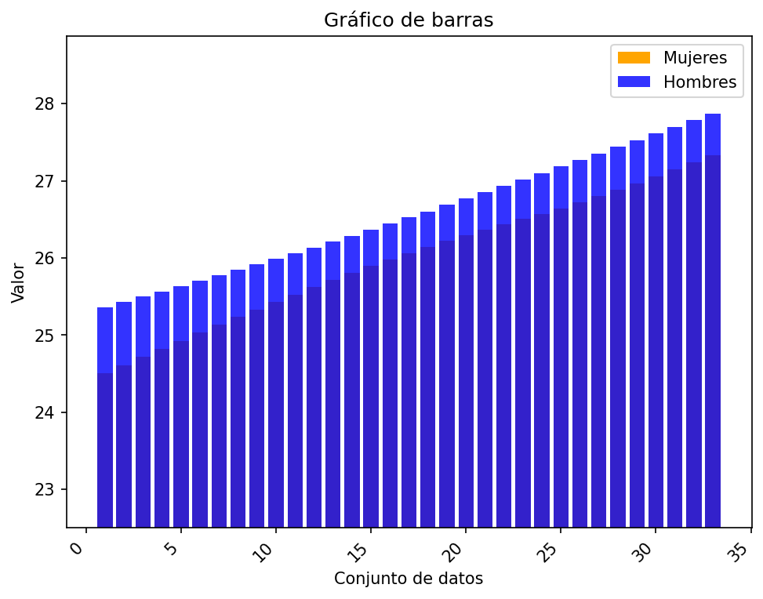
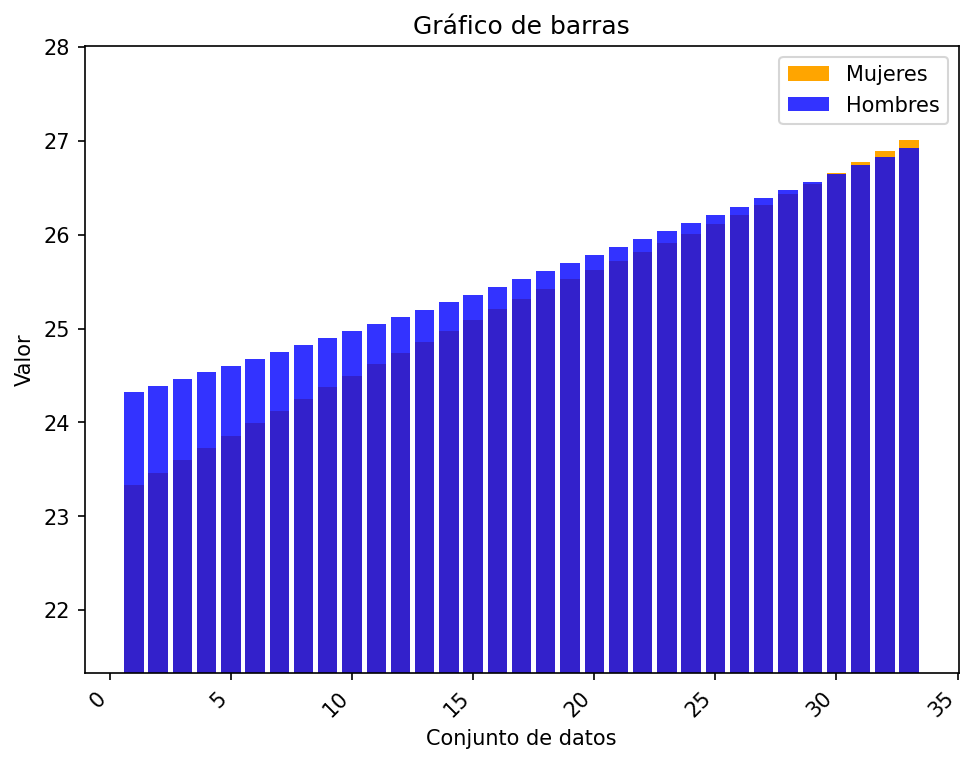
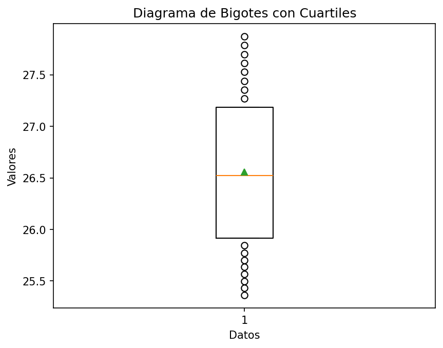
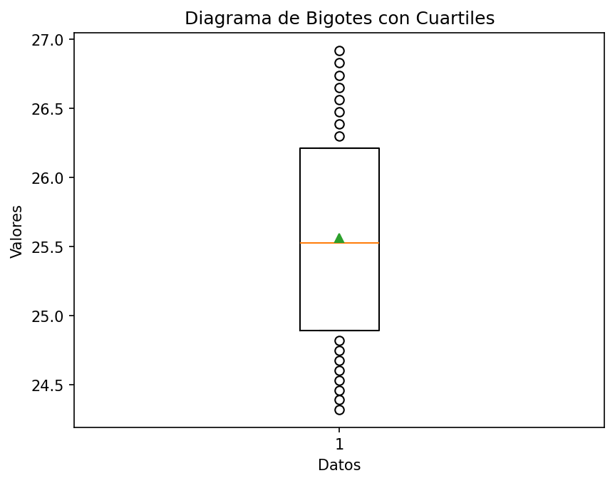
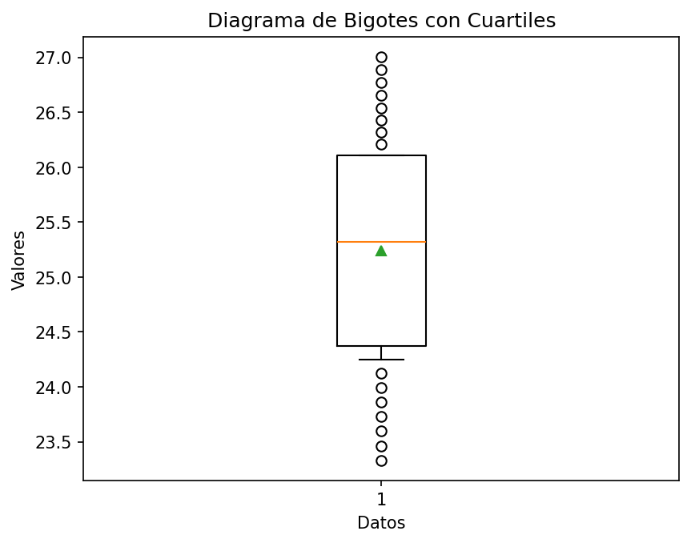

# Reporte de resultados Argentina

A continuación se presentan algunos resultados obtenidos.

## Medidas de tendencia

En la siguiente tabla se reportan los resultados de las medidas media, desviación estándar muestral, y los cuartiles.

| Conjunto de datos | media | desviación estándar | Q1 | Q2 | Q3 |
| :-- | :--: | :--: | :--: | :--: | :--: |
| Hombres Urbano | 26.559  | 0.763  | 25.914 | 26.523  | 27.185 |
| Hombres Rural | 25.561  | 0.789  | 24.895 | 25.525  | 26.210 |
| Mujeres Urbano | 25.989  | 0.829  | 25.334 | 26.065  | 26.645 |
| Mujeres Rural | 25.242  | 1.085  | 24.374 | 25.318  | 26.110 |

## Gráficos

A continuación se presentan los gráficos generados a partir del conjunto de datos.

#### Diagrama de barras 

Para los diagramas de barras se representan los valores 

#### Gráfico de barras Urbano

#### Gráfico de barras Rural

#### Diagrama de bigotes

##### Hombres urbano

##### Hombres rural

##### Mujeres urbano

##### Mujeres rural

