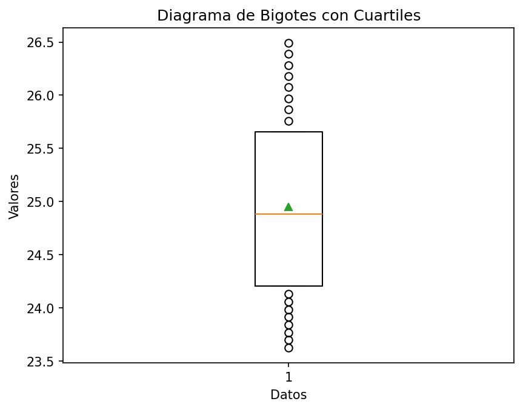
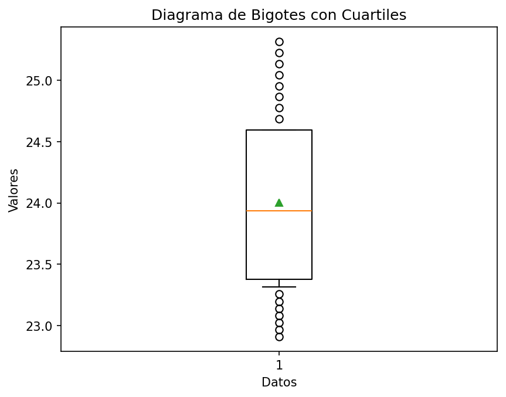
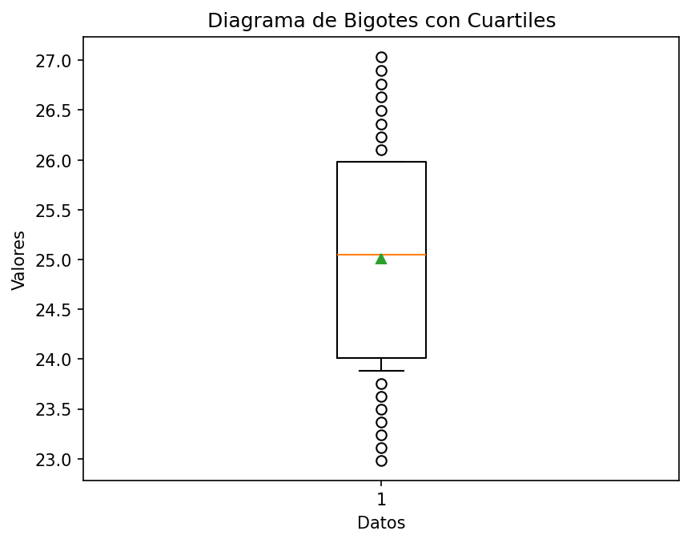

# Reporte de resultados Bolivia

A continuación se presentan algunos resultados obtenidos.

## Medidas de tendencia

En la siguiente tabla se reportan los resultados de las medidas media, desviación estándar muestral, y los cuartiles.

| Conjunto de datos | media | desviación estándar | Q1 | Q2 | Q3 |
| :-- | :--: | :--: | :--: | :--: | :--: |
| Hombres Urbano | 24.949  | 0.873  | 24.207 | 24.881  | 25.657 |
| Hombres Rural | 24.004  | 0.734  | 23.377 | 23.936  | 24.597 |
| Mujeres Urbano | 26.436  | 1.096  | 25.533 | 26.475  | 27.310 |
| Mujeres Rural | 25.011  | 1.210  | 24.013 | 25.050  | 25.980 |

## Gráficos

A continuación se presentan los gráficos generados a partir del conjunto de datos.

#### Diagrama de barras 

Para los diagramas de barras se representan los valores 

#### Gráfico de barras Urbano

#### Gráfico de barras Rural

#### Diagrama de bigotes

##### Hombres urbano

##### Hombres rural

##### Mujeres urbano

##### Mujeres rural

