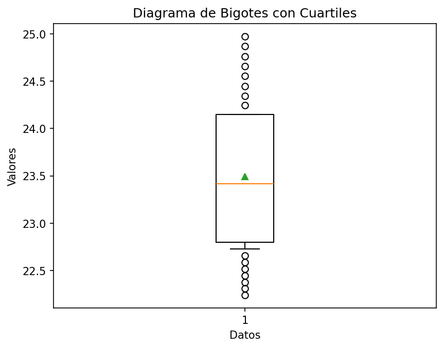

# Reporte de resultados Brazil

A continuación se presentan algunos resultados obtenidos.

## Medidas de tendencia

En la siguiente tabla se reportan los resultados de las medidas media, desviación estándar muestral, y los cuartiles.

| Conjunto de datos | media | desviación estándar | Q1 | Q2 | Q3 |
| :-- | :--: | :--: | :--: | :--: | :--: |
| Hombres Urbano | 24.940  | 0.818  | 24.254 | 24.866  | 25.592 |
| Hombres Rural | 23.490  | 0.824  | 22.799 | 23.416  | 24.147 |
| Mujeres Urbano | 25.475  | 0.733  | 24.869 | 25.359  | 26.001 |
| Mujeres Rural | 24.558  | 0.987  | 23.740 | 24.442  | 25.296 |

## Gráficos

A continuación se presentan los gráficos generados a partir del conjunto de datos.

#### Diagrama de barras 

Para los diagramas de barras se representan los valores 

#### Gráfico de barras Urbano

#### Gráfico de barras Rural

#### Diagrama de bigotes

##### Hombres urbano

##### Hombres rural

##### Mujeres urbano

##### Mujeres rural

