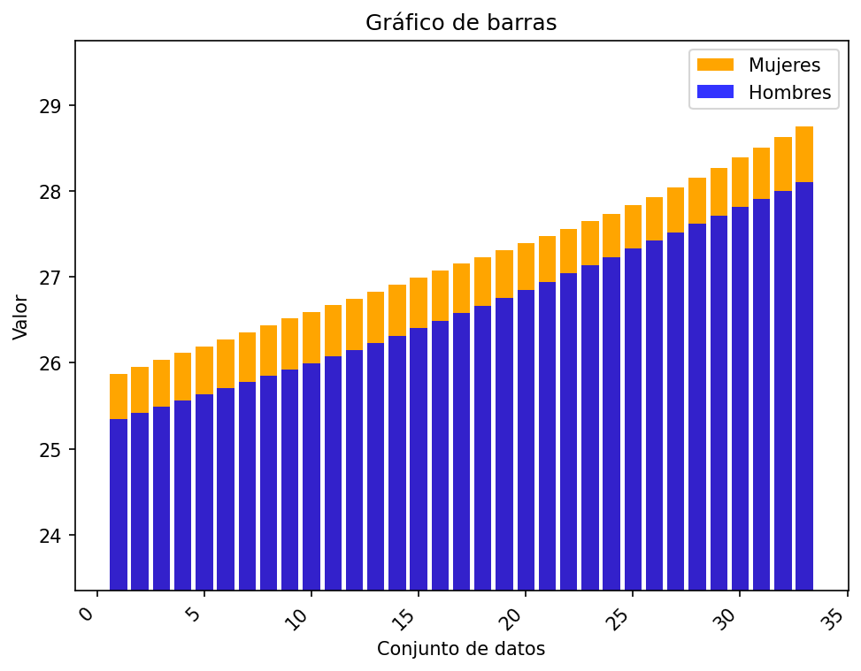
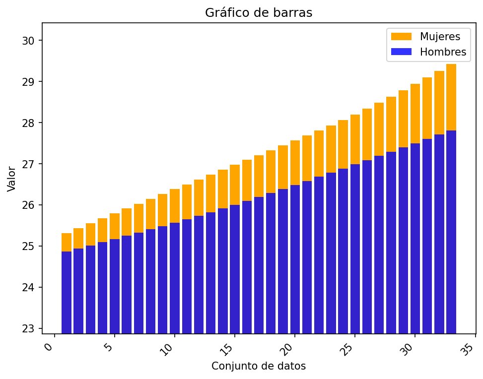
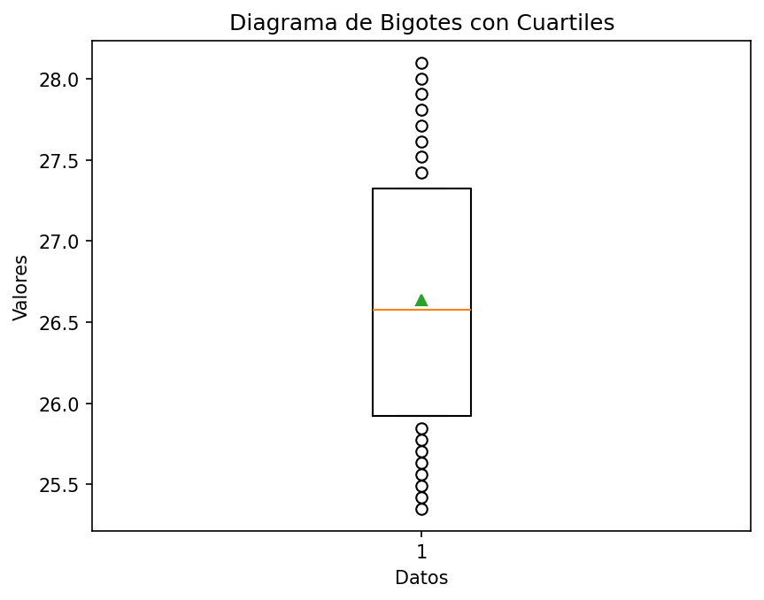
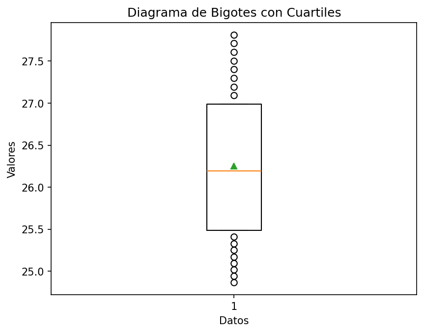
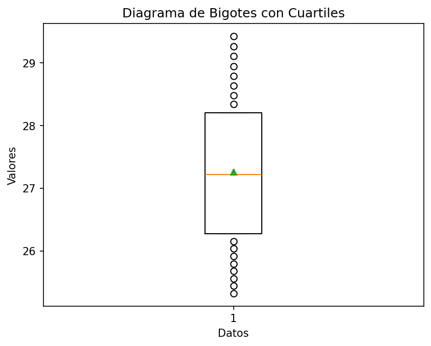

# Reporte de resultados Chile

A continuación se presentan algunos resultados obtenidos.

## Medidas de tendencia

En la siguiente tabla se reportan los resultados de las medidas media, desviación estándar muestral, y los cuartiles.

| Conjunto de datos | media | desviación estándar | Q1 | Q2 | Q3 |
| :-- | :--: | :--: | :--: | :--: | :--: |
| Hombres Urbano | 26.636  | 0.840  | 25.922 | 26.577  | 27.326 |
| Hombres Rural | 26.251  | 0.899  | 25.488 | 26.192  | 26.990 |
| Mujeres Urbano | 27.199  | 0.841  | 26.514 | 27.154  | 27.832 |
| Mujeres Rural | 27.260  | 1.210  | 26.269 | 27.215  | 28.199 |

## Gráficos

A continuación se presentan los gráficos generados a partir del conjunto de datos.

#### Diagrama de barras 

Para los diagramas de barras se representan los valores 

#### Gráfico de barras Urbano

#### Gráfico de barras Rural

#### Diagrama de bigotes

##### Hombres urbano

##### Hombres rural

##### Mujeres urbano

##### Mujeres rural

