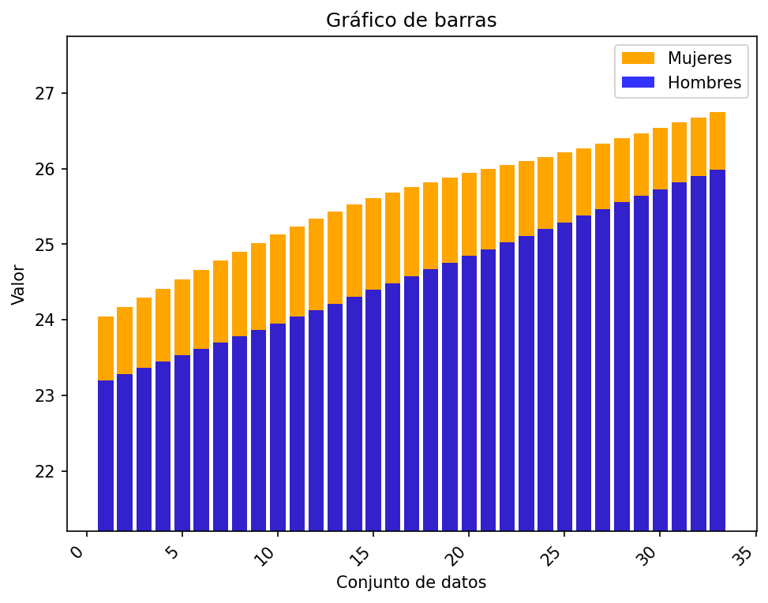
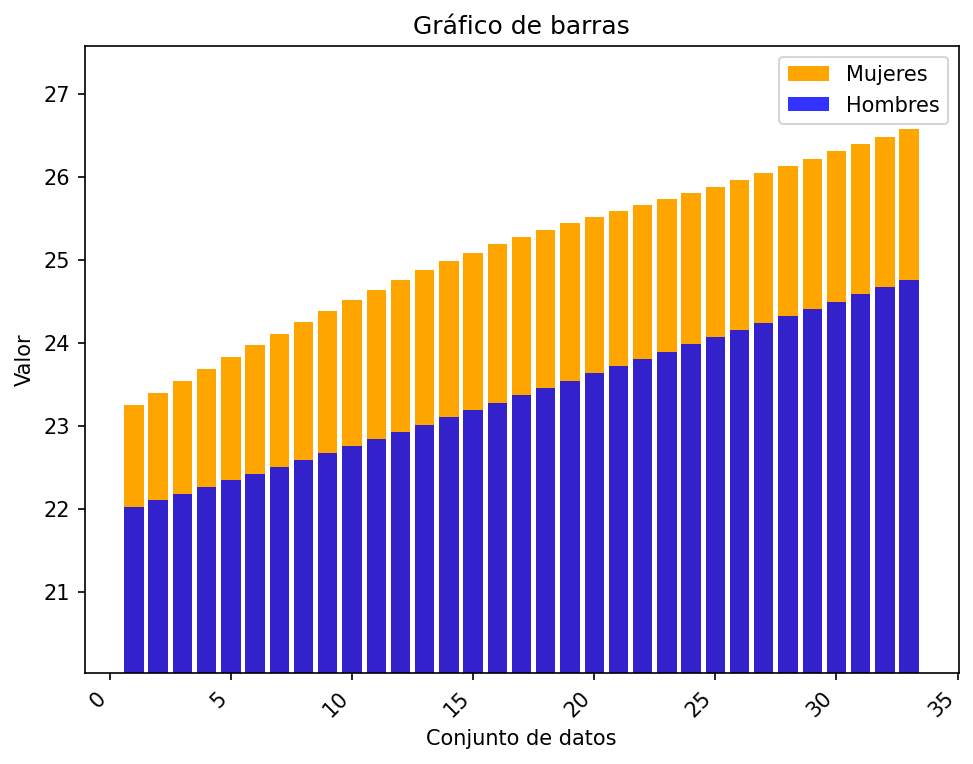

# Reporte de resultados Colombia

A continuación se presentan algunos resultados obtenidos.

## Medidas de tendencia

En la siguiente tabla se reportan los resultados de las medidas media, desviación estándar muestral, y los cuartiles.

| Conjunto de datos | media | desviación estándar | Q1 | Q2 | Q3 |
| :-- | :--: | :--: | :--: | :--: | :--: |
| Hombres Urbano | 24.583  | 0.850  | 23.870 | 24.577  | 25.291 |
| Hombres Rural | 23.376  | 0.833  | 22.677 | 23.370  | 24.071 |
| Mujeres Urbano | 25.599  | 0.788  | 25.020 | 25.759  | 26.212 |
| Mujeres Rural | 25.119  | 0.972  | 24.387 | 25.279  | 25.886 |

## Gráficos

A continuación se presentan los gráficos generados a partir del conjunto de datos.

#### Diagrama de barras 

Para los diagramas de barras se representan los valores 

#### Gráfico de barras Urbano

#### Gráfico de barras Rural

#### Diagrama de bigotes

##### Hombres urbano

##### Hombres rural

##### Mujeres urbano

##### Mujeres rural

