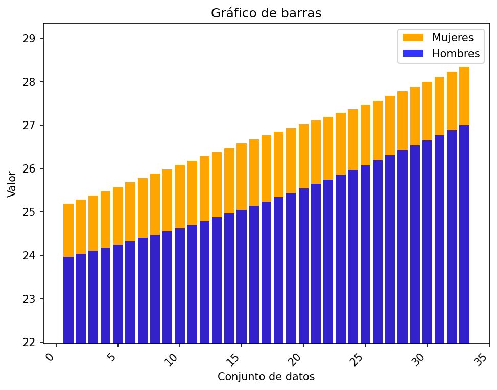
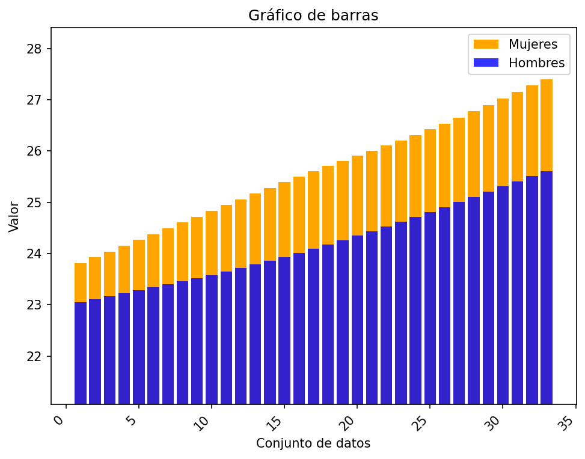
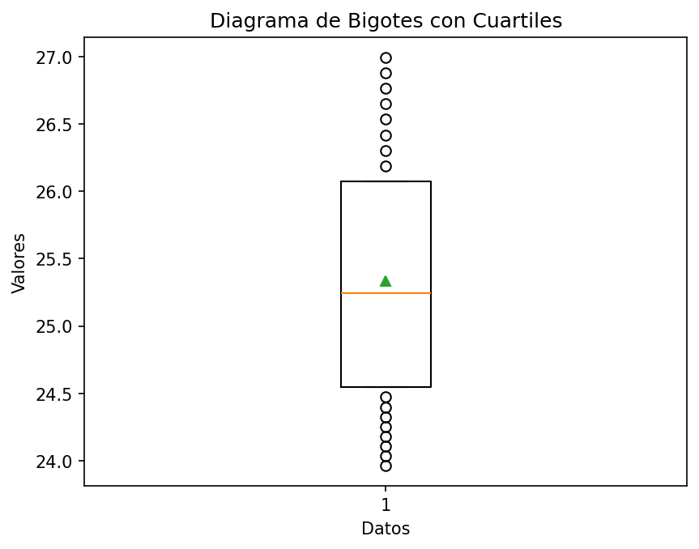
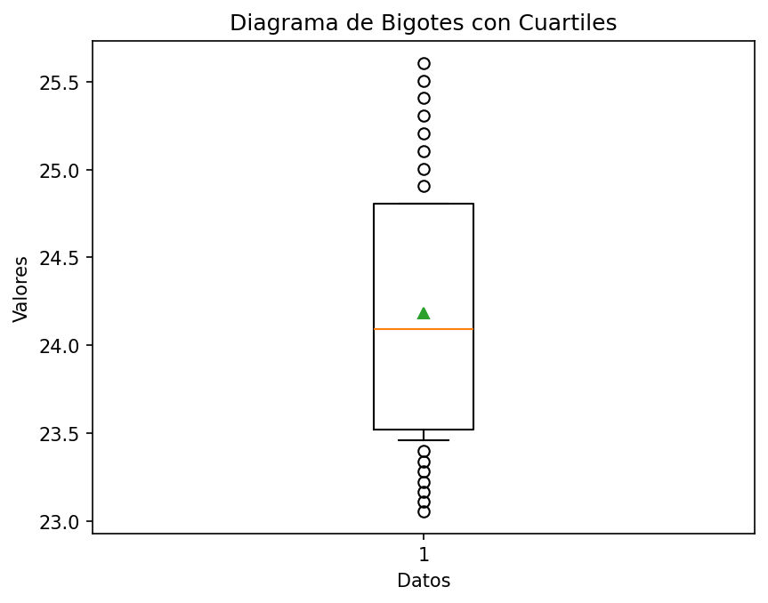
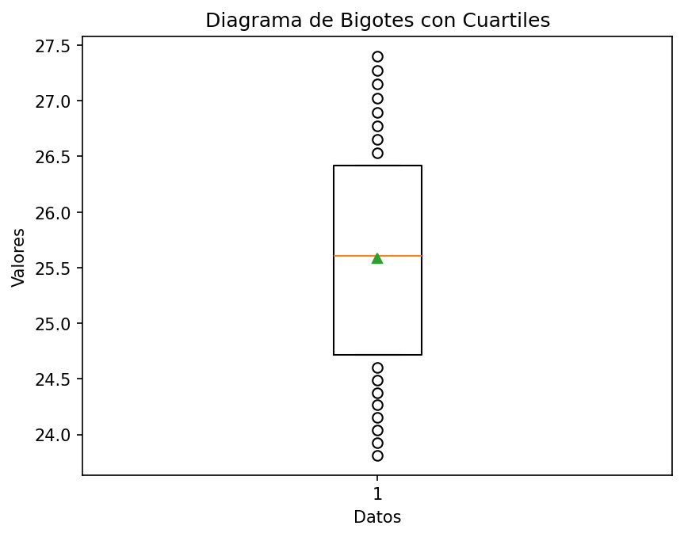

# Reporte de resultados Ecuador

A continuación se presentan algunos resultados obtenidos.

## Medidas de tendencia

En la siguiente tabla se reportan los resultados de las medidas media, desviación estándar muestral, y los cuartiles.

| Conjunto de datos | media | desviación estándar | Q1 | Q2 | Q3 |
| :-- | :--: | :--: | :--: | :--: | :--: |
| Hombres Urbano | 25.334  | 0.923  | 24.549 | 25.241  | 26.075 |
| Hombres Rural | 24.185  | 0.779  | 23.520 | 24.093  | 24.807 |
| Mujeres Urbano | 26.740  | 0.930  | 25.981 | 26.760  | 27.465 |
| Mujeres Rural | 25.586  | 1.062  | 24.718 | 25.606  | 26.421 |

## Gráficos

A continuación se presentan los gráficos generados a partir del conjunto de datos.

#### Diagrama de barras 

Para los diagramas de barras se representan los valores 

#### Gráfico de barras Urbano

#### Gráfico de barras Rural

#### Diagrama de bigotes

##### Hombres urbano

##### Hombres rural

##### Mujeres urbano

##### Mujeres rural

