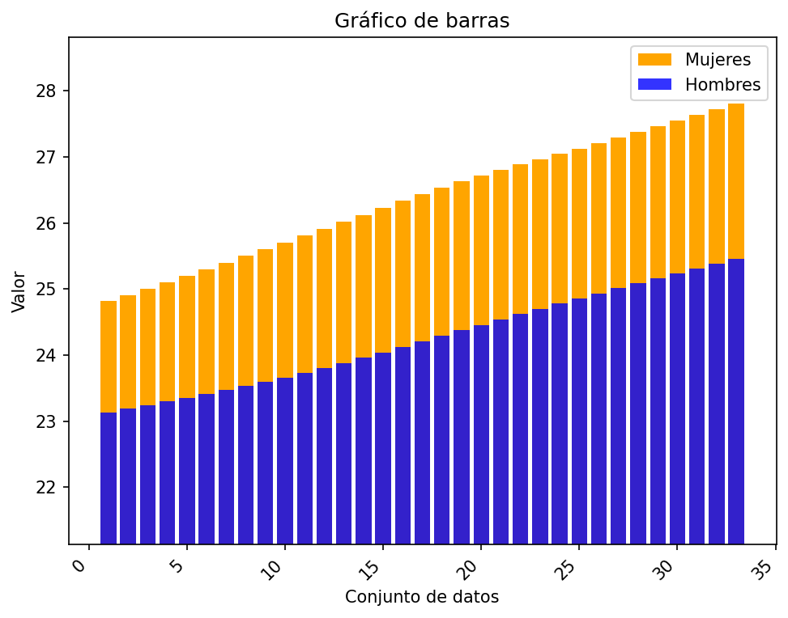
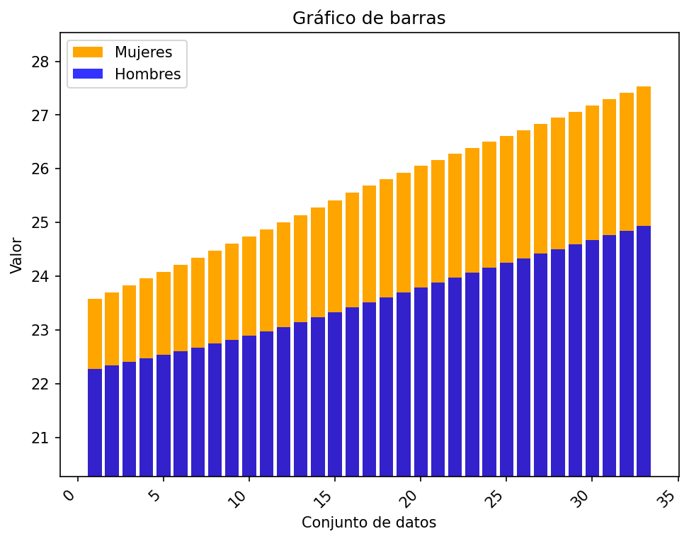
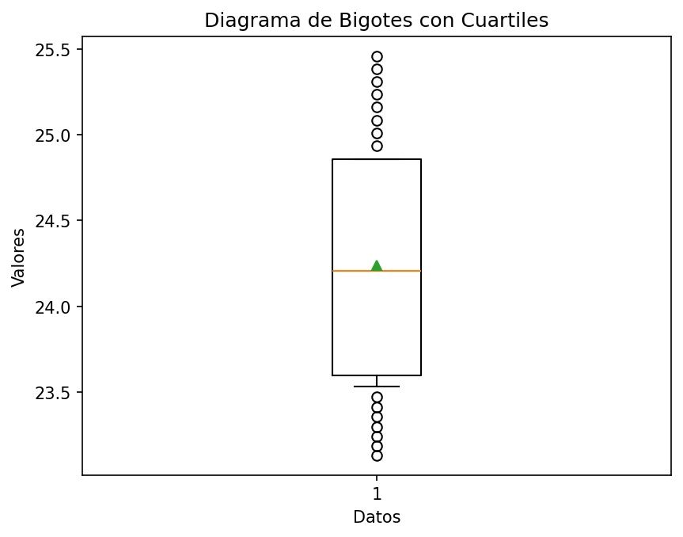
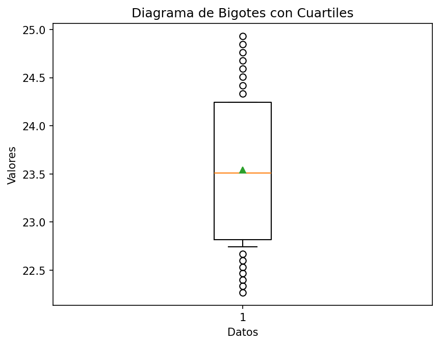
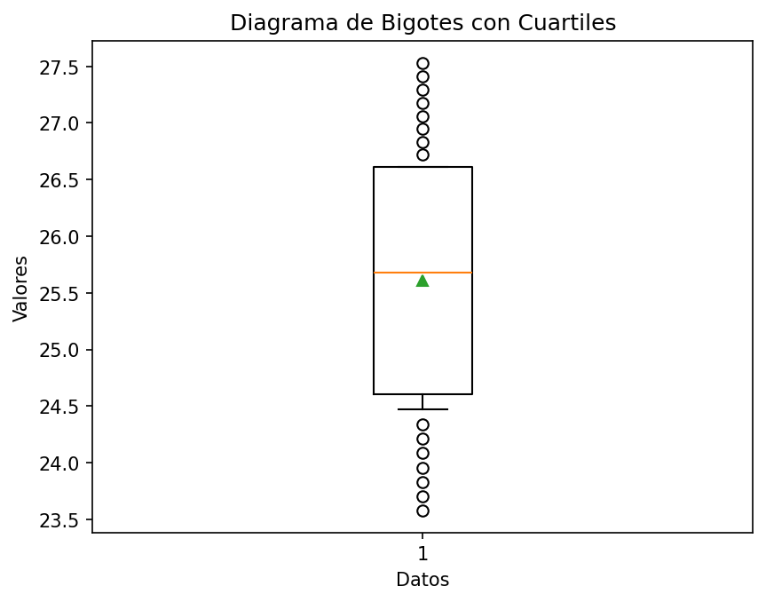

# Reporte de resultados Guyana

A continuación se presentan algunos resultados obtenidos.

## Medidas de tendencia

En la siguiente tabla se reportan los resultados de las medidas media, desviación estándar muestral, y los cuartiles.

| Conjunto de datos | media | desviación estándar | Q1 | Q2 | Q3 |
| :-- | :--: | :--: | :--: | :--: | :--: |
| Hombres Urbano | 24.237  | 0.728  | 23.596 | 24.206  | 24.857 |
| Hombres Rural | 23.542  | 0.830  | 22.817 | 23.511  | 24.246 |
| Mujeres Urbano | 26.368  | 0.913  | 25.601 | 26.439  | 27.127 |
| Mujeres Rural | 25.611  | 1.203  | 24.604 | 25.682  | 26.610 |

## Gráficos

A continuación se presentan los gráficos generados a partir del conjunto de datos.

#### Diagrama de barras 

Para los diagramas de barras se representan los valores 

#### Gráfico de barras Urbano

#### Gráfico de barras Rural

#### Diagrama de bigotes

##### Hombres urbano

##### Hombres rural

##### Mujeres urbano

##### Mujeres rural

