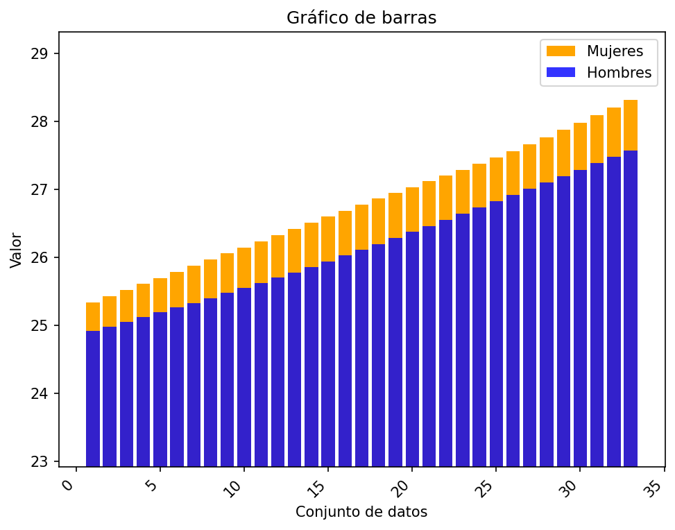
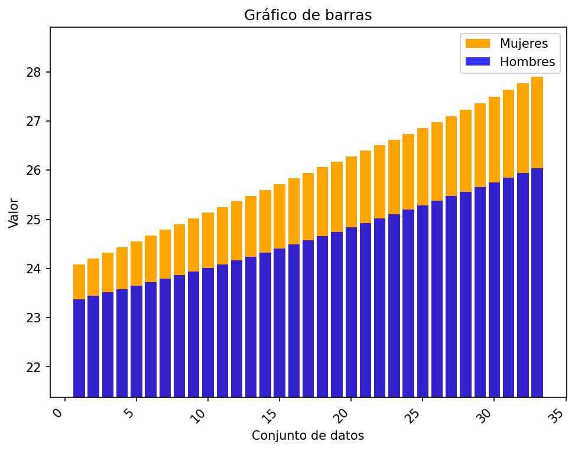
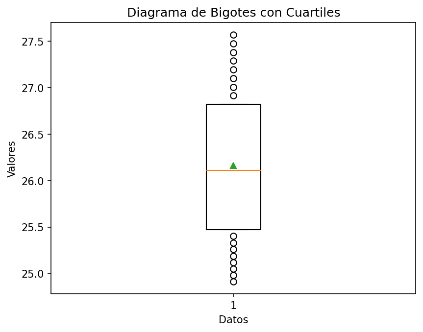
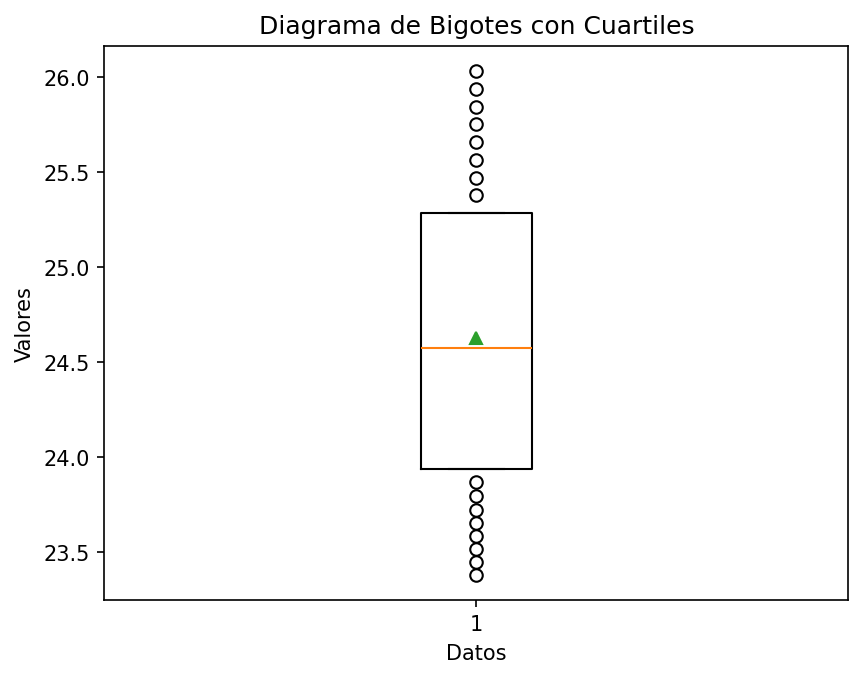
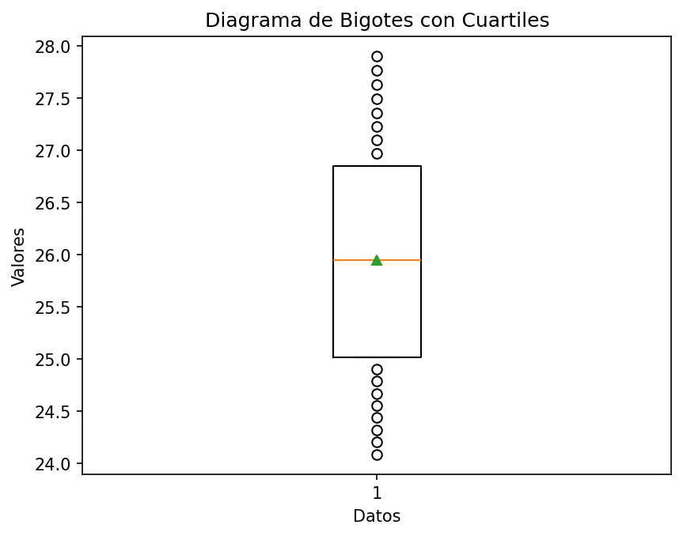

# Reporte de resultados Paraguay

A continuación se presentan algunos resultados obtenidos.

## Medidas de tendencia

En la siguiente tabla se reportan los resultados de las medidas media, desviación estándar muestral, y los cuartiles.

| Conjunto de datos | media | desviación estándar | Q1 | Q2 | Q3 |
| :-- | :--: | :--: | :--: | :--: | :--: |
| Hombres Urbano | 26.160  | 0.810  | 25.473 | 26.109  | 26.823 |
| Hombres Rural | 24.624  | 0.809  | 23.938 | 24.574  | 25.286 |
| Mujeres Urbano | 26.778  | 0.880  | 26.057 | 26.774  | 27.468 |
| Mujeres Rural | 25.950  | 1.134  | 25.019 | 25.946  | 26.850 |

## Gráficos

A continuación se presentan los gráficos generados a partir del conjunto de datos.

#### Diagrama de barras 

Para los diagramas de barras se representan los valores 

#### Gráfico de barras Urbano

#### Gráfico de barras Rural

#### Diagrama de bigotes

##### Hombres urbano

##### Hombres rural

##### Mujeres urbano

##### Mujeres rural

