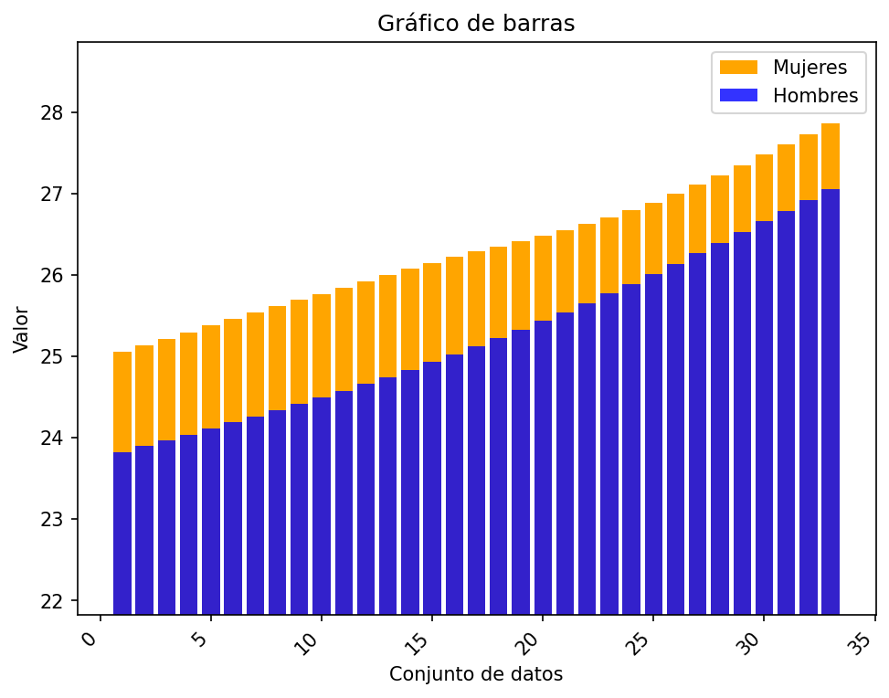
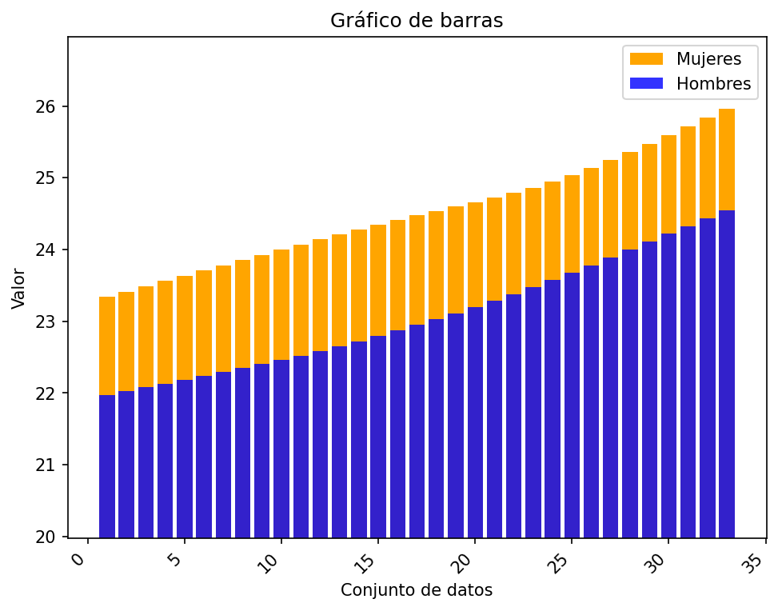
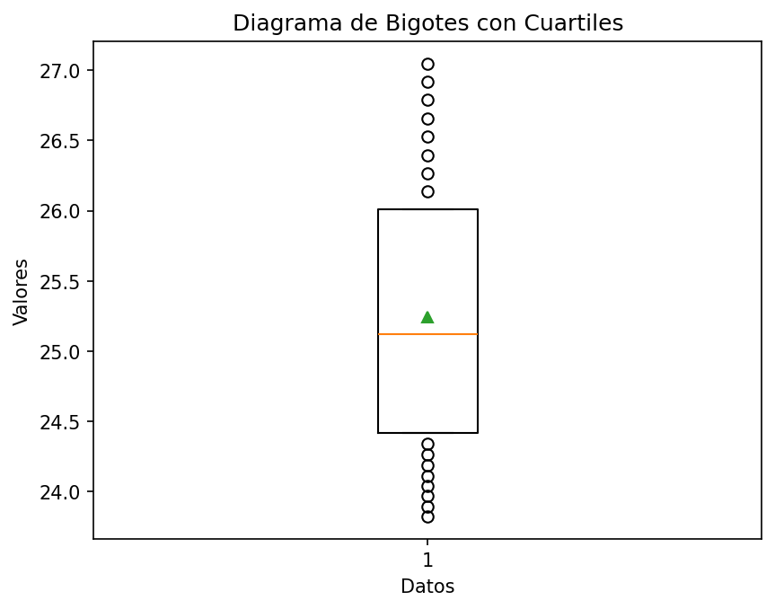
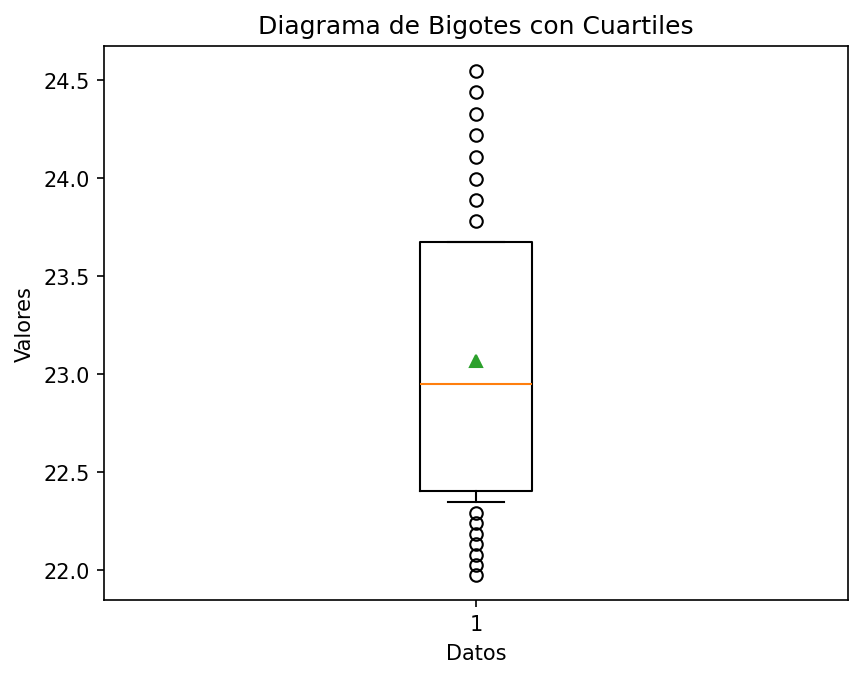
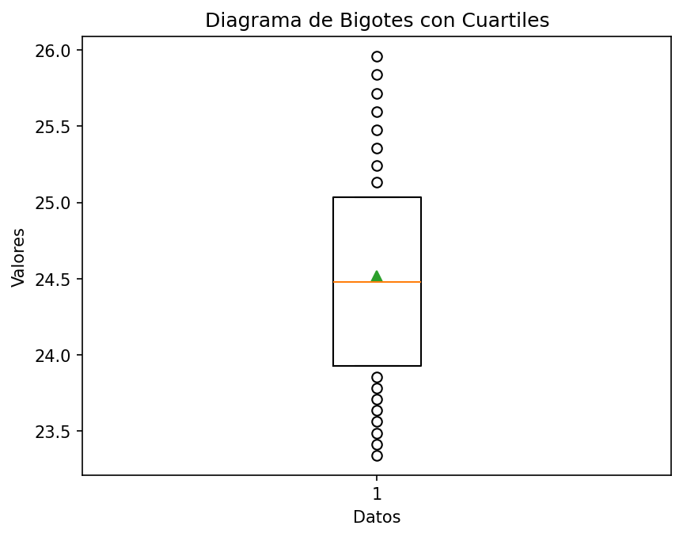

# Reporte de resultados Peru

A continuación se presentan algunos resultados obtenidos.

## Medidas de tendencia

En la siguiente tabla se reportan los resultados de las medidas media, desviación estándar muestral, y los cuartiles.

| Conjunto de datos | media | desviación estándar | Q1 | Q2 | Q3 |
| :-- | :--: | :--: | :--: | :--: | :--: |
| Hombres Urbano | 25.243  | 0.977  | 24.414 | 25.122  | 26.013 |
| Hombres Rural | 23.068  | 0.781  | 22.403 | 22.948  | 23.675 |
| Mujeres Urbano | 26.326  | 0.799  | 25.691 | 26.285  | 26.886 |
| Mujeres Rural | 24.519  | 0.746  | 23.927 | 24.478  | 25.035 |

## Gráficos

A continuación se presentan los gráficos generados a partir del conjunto de datos.

#### Diagrama de barras 

Para los diagramas de barras se representan los valores 

#### Gráfico de barras Urbano

#### Gráfico de barras Rural

#### Diagrama de bigotes

##### Hombres urbano

##### Hombres rural

##### Mujeres urbano

##### Mujeres rural

