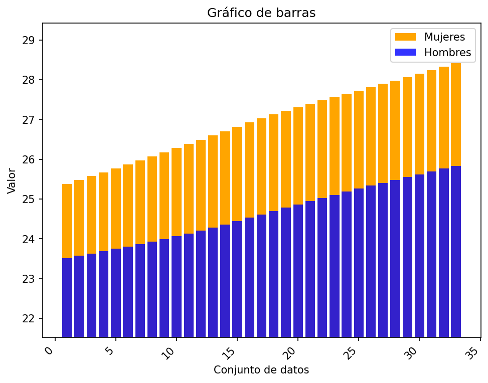
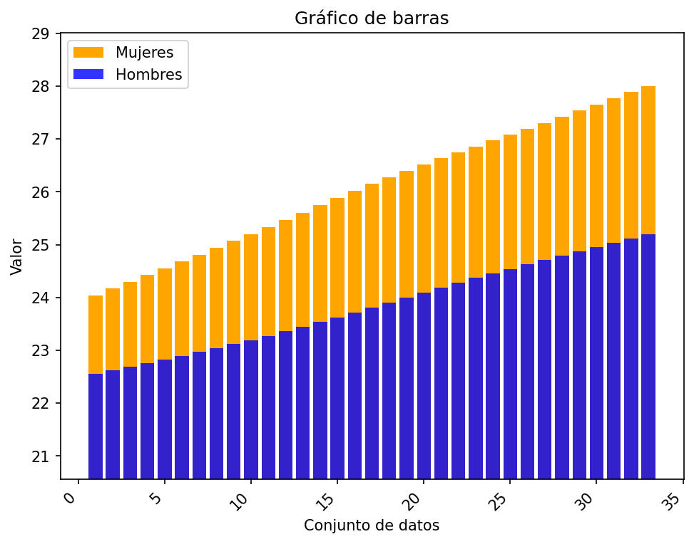

# Reporte de resultados Suriname

A continuación se presentan algunos resultados obtenidos.

## Medidas de tendencia

En la siguiente tabla se reportan los resultados de las medidas media, desviación estándar muestral, y los cuartiles.

| Conjunto de datos | media | desviación estándar | Q1 | Q2 | Q3 |
| :-- | :--: | :--: | :--: | :--: | :--: |
| Hombres Urbano | 24.635  | 0.727  | 23.995 | 24.613  | 25.260 |
| Hombres Rural | 23.836  | 0.826  | 23.114 | 23.813  | 24.542 |
| Mujeres Urbano | 26.957  | 0.926  | 26.178 | 27.027  | 27.727 |
| Mujeres Rural | 26.080  | 1.206  | 25.069 | 26.150  | 27.081 |

## Gráficos

A continuación se presentan los gráficos generados a partir del conjunto de datos.

#### Diagrama de barras 

Para los diagramas de barras se representan los valores 

#### Gráfico de barras Urbano

#### Gráfico de barras Rural

#### Diagrama de bigotes

##### Hombres urbano

##### Hombres rural

##### Mujeres urbano

##### Mujeres rural

