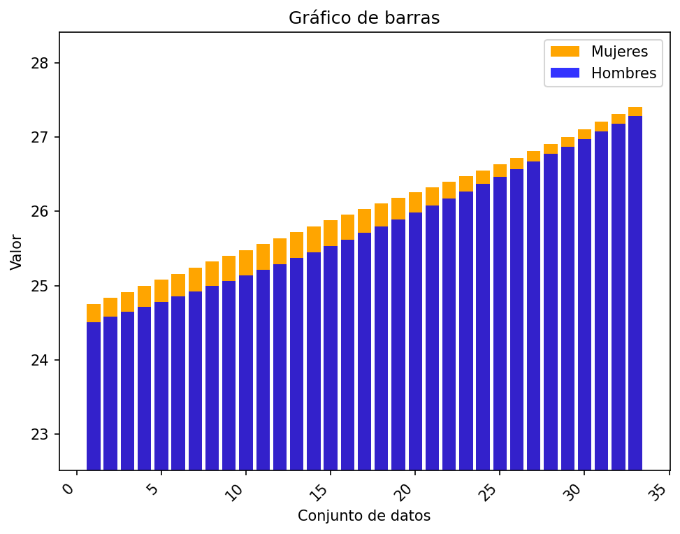
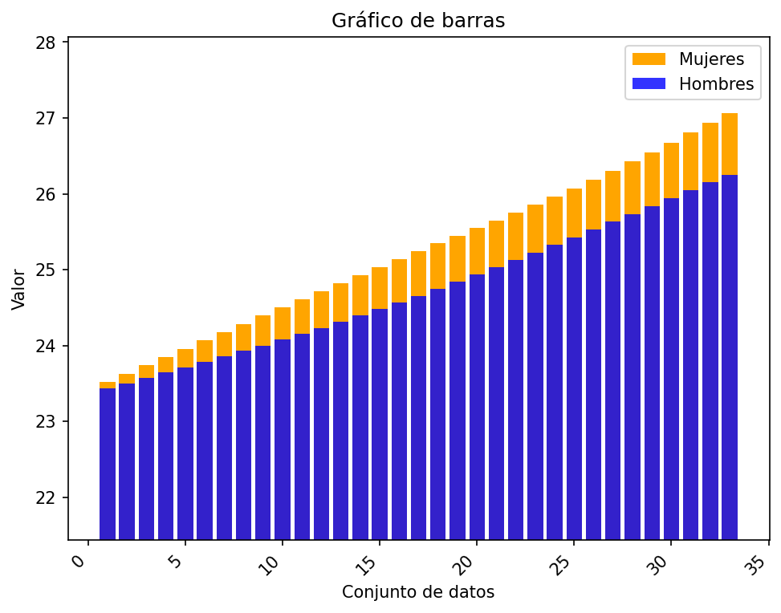
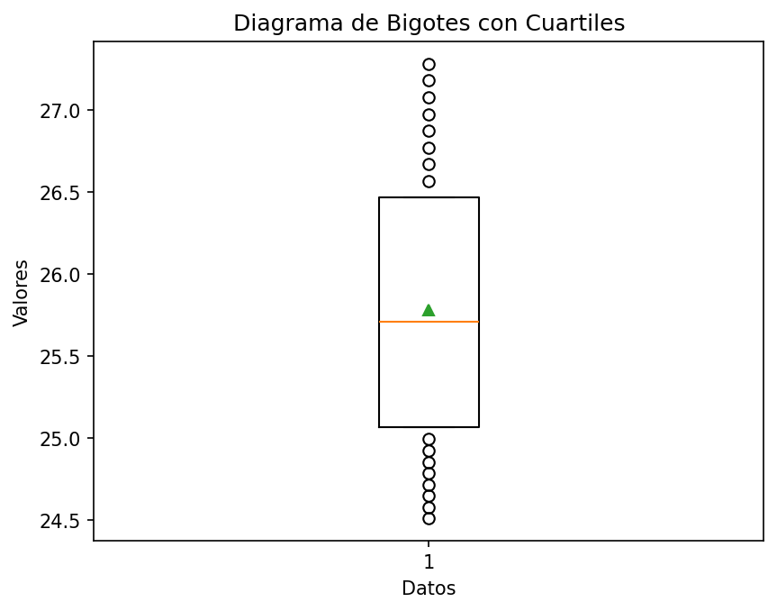
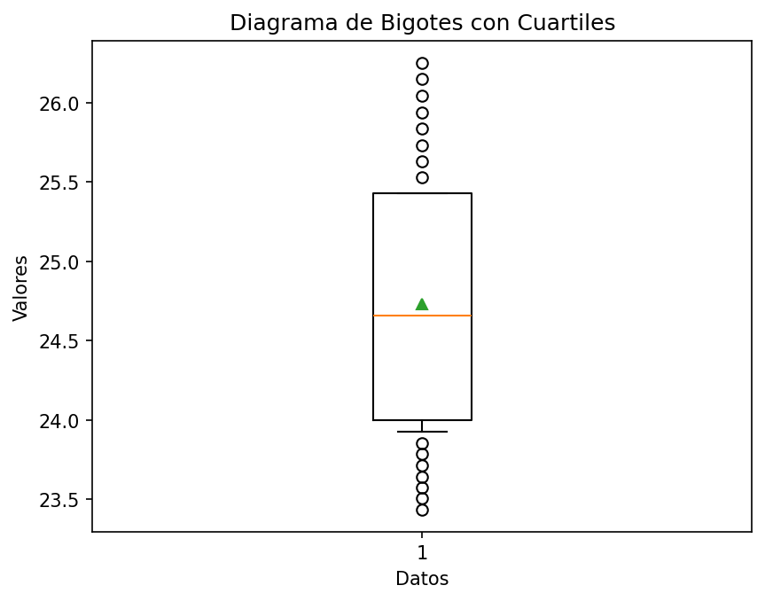
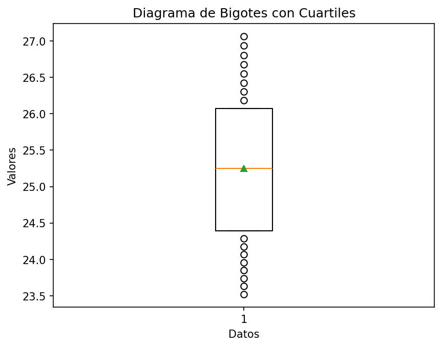

# Reporte de resultados Uruguay

A continuación se presentan algunos resultados obtenidos.

## Medidas de tendencia

En la siguiente tabla se reportan los resultados de las medidas media, desviación estándar muestral, y los cuartiles.

| Conjunto de datos | media | desviación estándar | Q1 | Q2 | Q3 |
| :-- | :--: | :--: | :--: | :--: | :--: |
| Hombres Urbano | 25.782  | 0.844  | 25.065 | 25.708  | 26.468 |
| Hombres Rural | 24.730  | 0.858  | 24.001 | 24.656  | 25.427 |
| Mujeres Urbano | 26.034  | 0.779  | 25.401 | 26.032  | 26.634 |
| Mujeres Rural | 25.248  | 1.047  | 24.394 | 25.246  | 26.070 |

## Gráficos

A continuación se presentan los gráficos generados a partir del conjunto de datos.

#### Diagrama de barras 

Para los diagramas de barras se representan los valores 

#### Gráfico de barras Urbano

#### Gráfico de barras Rural

#### Diagrama de bigotes

##### Hombres urbano

##### Hombres rural

##### Mujeres urbano

##### Mujeres rural

