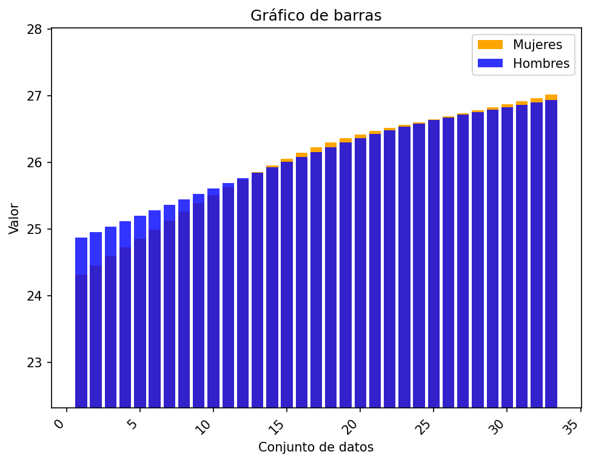
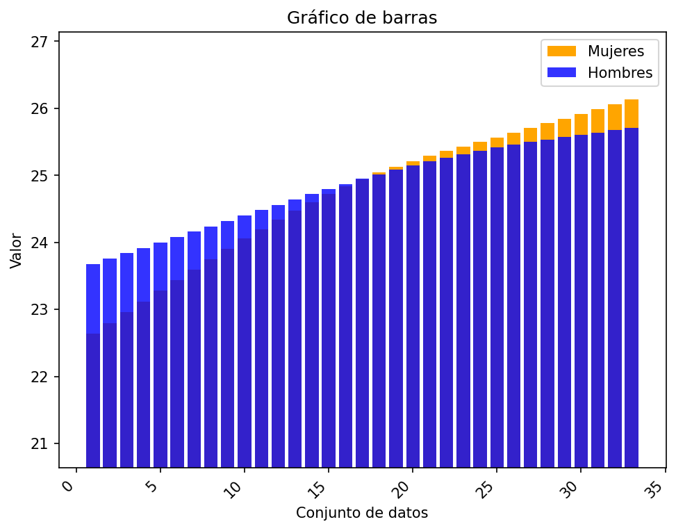
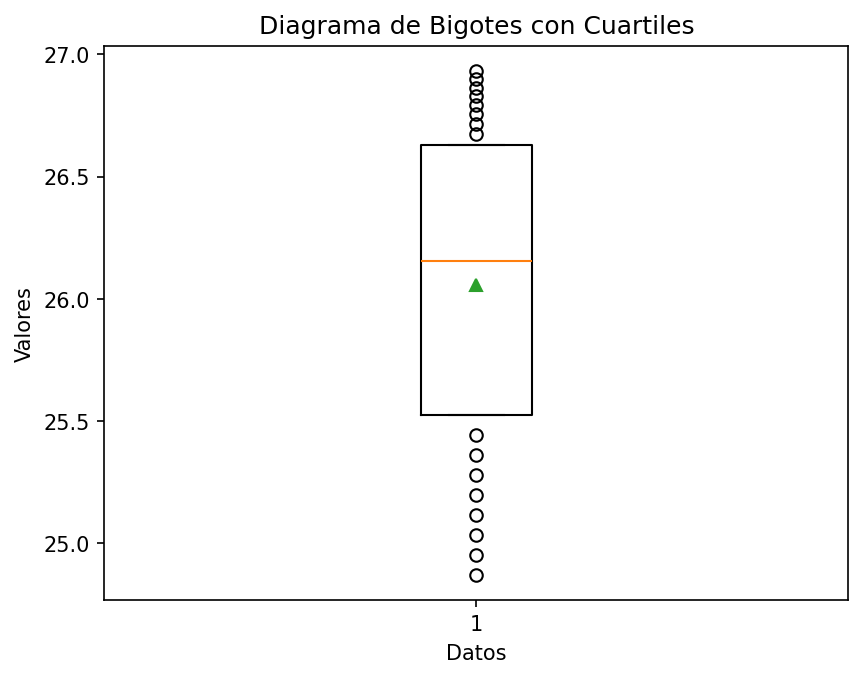
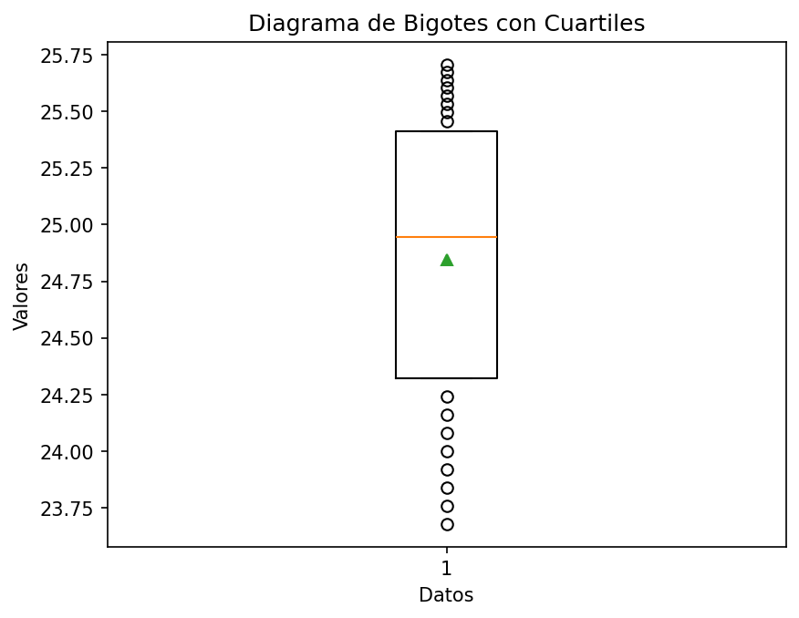
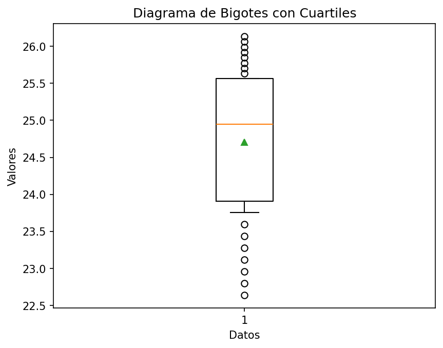

# Reporte de resultados Venezuela

A continuación se presentan algunos resultados obtenidos.

## Medidas de tendencia

En la siguiente tabla se reportan los resultados de las medidas media, desviación estándar muestral, y los cuartiles.

| Conjunto de datos | media | desviación estándar | Q1 | Q2 | Q3 |
| :-- | :--: | :--: | :--: | :--: | :--: |
| Hombres Urbano | 26.056  | 0.648  | 25.523 | 26.156  | 26.631 |
| Hombres Rural | 24.846  | 0.639  | 24.322 | 24.947  | 25.413 |
| Mujeres Urbano | 25.984  | 0.814  | 25.386 | 26.224  | 26.644 |
| Mujeres Rural | 24.705  | 1.052  | 23.907 | 24.946  | 25.567 |

## Gráficos

A continuación se presentan los gráficos generados a partir del conjunto de datos.

#### Diagrama de barras 

Para los diagramas de barras se representan los valores 

#### Gráfico de barras Urbano

#### Gráfico de barras Rural

#### Diagrama de bigotes

##### Hombres urbano

##### Hombres rural

##### Mujeres urbano

##### Mujeres rural

